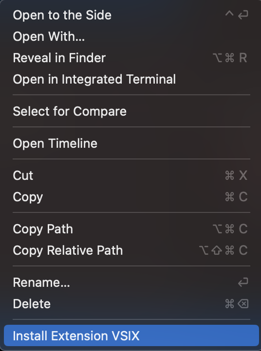

# nbdev VSCode

> An experimental nbdev extension to VSCode

## Installation

1. Download the file `wget https://github.com/fastai/nbdev-vscode/raw/main/nbdev-0.0.1.vsix`
2. Open VSCode in the current directory `code.``
3. In the file explorer, right-click `nbdev-0.0.1.vsix` and select `Install Extension VSIX`:



## Usage

From any nbdev python module file, press `F12` on a cell comment that looks like this:

```python
# %% ../nbs/00_core.ipynb 7
```

This will take you to the corresponding notebook associated with that comment.

## TODO

Go to the right cell in the notebook.

